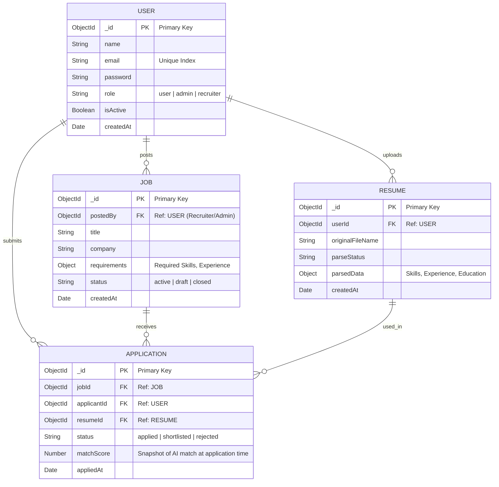

# HireSense Entity-Relationship (ER) Diagram

The following diagram maps out the database schema, illustrating the entities, their properties, primary/foreign keys, and their cardinality.

### Relationship Breakdown

* **USER to RESUME (1:N)**: A single `User` (Candidate) can upload multiple `Resumes` over time tailored for different roles.
* **USER to JOB (1:N)**: A single `User` (acting as a Recruiter or Admin) can post multiple `Jobs`.
* **Many-to-Many Resolution (APPLICATION)**:
  * The `APPLICATION` entity acts as a junction (join table) resolving the Many-to-Many relationship between `USER` and `JOB`.
  * It records that a specific **Candidate** applied to a specific **Job** on a specific date, and it inherently references the specific **Resume** they chose to use for that application.
  * We enforce a compound unique index on `{ jobId, applicantId }` inside the application schema to prevent a user from applying to the exact same job twice.
