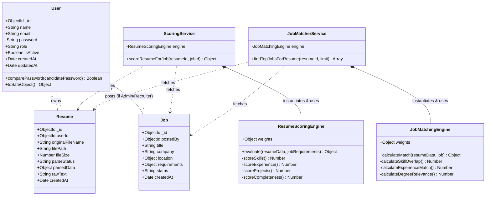

# HireSense Class Diagram

The following diagram illustrates the structural design of the core models and services in the HireSense backend architecture.

### Diagram Breakdown

#### Models
* **User**: Represents the base entity for authentication. Holds standard properties and methods to verify passwords and sanitize responses.
* **Resume**: Stores file metadata and the structured, AI-parsed JSON payload (`parsedData`). Contains a foreign key reference (`userId`) to the User.
* **Job**: Contains details regarding an open role, including embedded documents for `location` and `requirements`. Contains a foreign key reference (`postedBy`) pointing back to the User/Admin who created it.

#### Services & Engines
To maintain **Clean Architecture** and the **Single Responsibility Principle**, high-level orchestration services are decoupled from the algorithmic matching engines:

* **ScoringService / ResumeScoringEngine**: Evaluates a resume's intrinsic quality (ATS readability, presence of projects, etc.). The Service fetches data from the DB, while the Engine performs the pure mathematical logic.
* **JobMatcherService / JobMatchingEngine**: Calculates the compatibility overlap between a specific resume and a pool of active jobs. The Service orchestrates the bulk database queries, feeding them one by one into the Engine to generate a percentage score.
