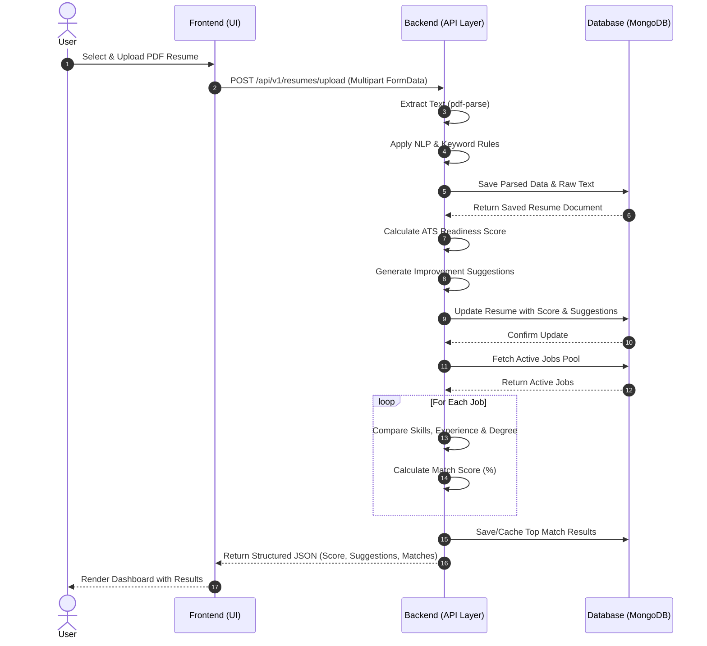

# HireSense Main Flow: Sequence Diagram

The following sequence diagram illustrates the core journey of a candidate utilizing the HireSense platform.

### Flow Breakdown

1. **Upload Resume**: The user uploads their resume via the `Frontend`. The file is sent to the `Backend` via a multipart request.
2. **System Parses**: The `Backend` extracts the raw text from the PDF and runs it through the rule-based parsing engine to extract skills, education, and experience. This parsed structure is saved to the `Database`.
3. **Score & Suggestions Generated**: The `Backend` instantly evaluates the parsed data to calculate an ATS readiness score and generates a list of actionable suggestions (e.g., "Add more measurable metrics").
4. **Job Matching**: The `Backend` queries the `Database` for active jobs. It runs the parsed resume against each job's requirements, outputting a match percentage based on skill overlap and experience.
5. **Results Shown**: The final consolidated data is sent back to the `Frontend`, which renders the interactive dashboard for the `User`.
