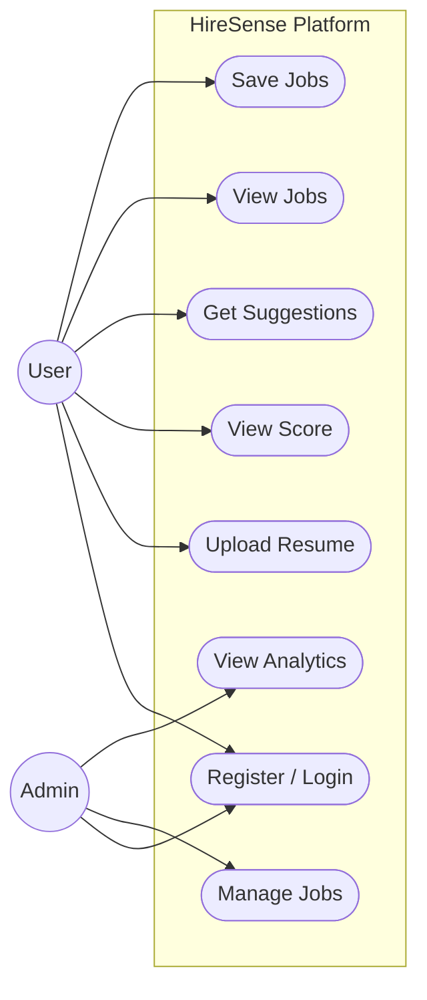

# HireSense Use Case Diagram

The following diagram outlines the primary actors and their interactions with the HireSense platform.

### Breakdown of Actors and Use Cases

#### Actors
* **User**: A job seeker utilizing the platform to analyze their resume and find matching jobs.
* **Admin**: A recruiter or system administrator responsible for managing job postings and platform metrics.

#### Use Cases (User)
* **Register / Login**: Secure authentication into the platform.
* **Upload Resume**: Uploading a PDF resume for AI parsing and text extraction.
* **View Score**: Checking the ATS-readiness score or the specific match score against a job.
* **Get Suggestions**: Receiving actionable, rule-based feedback to improve resume quality.
* **View Jobs**: Browsing active job postings or seeing algorithmically matched jobs.
* **Save Jobs**: Bookmarking jobs for later application.

#### Use Cases (Admin)
* **Manage Jobs**: Performing CRUD operations (Create, Read, Update, Delete) on job postings.
* **View Analytics**: Monitoring platform usage, applicant counts, and overall system health.
